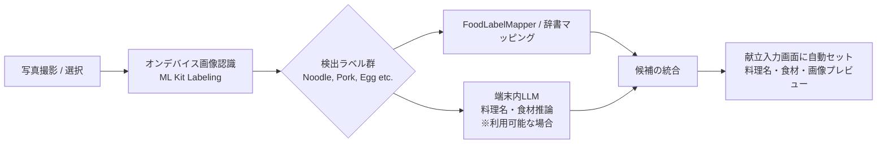

# 写真撮影によるオンデバイス献立自動解析機能 実装計画

## 概要
献立入力画面（`MealRecordInputScreen`）にて、カメラ撮影またはアルバムから写真を選択し、完全端末内（オンデバイス）で料理名・食材候補を自動解析して入力欄にプリフィルする機能を実装します。

本プロジェクトの基本方針（**完全端末内・オフライン・APIコスト0**）を維持するため、**軽量オンデバイス画像認識（ML Kit / ラベル抽出） ＋ 端末内LLM（Qwen2.5 / Native LLM）による料理名・食材の日本語補完** のハイブリッド構成を採用します。

---

## 採用アーキテクチャ（ハイブリッド・オンデバイス解析）



1. **Vision層**: `image_picker` で写真取得 ➔ `google_mlkit_image_labeling`（または軽量オンデバイスラベル認識）で写真の物体・食材・料理特徴ラベルを高速・端末内で抽出。
2. **推論/マッピング層**:
   - `FoodLabelMapper`: 主要な料理・食材ラベル（日・英）の高速辞書マッピング。
   - `LlmService`（オプション連携）: 端末内LLMが準備完了していれば、検出ラベル群から自然な日本語料理名（例:「豚骨ラーメン」）や主な材料をオフラインで推定。
3. **UI/UX層**:
   - 入力画面にカメラ・アルバム起動ボタンと画像プレビュー領域を設置。
   - 解析中はローディング表示。
   - 解析完了後、料理名TextFieldに自動セット ＋ 複数候補がある場合はチップ選択可能。

---

## ユーザー確認・検討事項

> [!NOTE]
> - **トピックブランチ**: `feature/photo-meal-recognition` を作成して作業します。
> - **権限設定**: iOSの `Info.plist`（`NSCameraUsageDescription`, `NSPhotoLibraryUsageDescription`）およびAndroidの設定を追加します。
> - **オフライン性**: 画像解析およびテキスト生成のすべてが端末内で完結し、外部ネットワークへの通信は発生しません。

---

## 変更対象ファイル一覧

### 1. 依存関係 & 設定ファイル
- #### [MODIFY] [pubspec.yaml](../pubspec.yaml)
  - `image_picker` の追加
  - `google_mlkit_image_labeling` の追加
- #### [MODIFY] [ios/Runner/Info.plist](../ios/Runner/Info.plist)
  - カメラ・フォトライブラリ利用理由の説明（`NSCameraUsageDescription`, `NSPhotoLibraryUsageDescription`）を追加
- #### [MODIFY] [android/app/src/main/AndroidManifest.xml](../android/app/src/main/AndroidManifest.xml)
  - 写真取得に関する権限・プロバイダ設定の確認と調整

### 2. コア / 画像解析サービス層 (`lib/core/vision/` または `lib/features/meal_record/`)
- #### [NEW] [`meal_image_service.dart`](../lib/features/meal_record/data/meal_image_service.dart)
  - 画像からラベルを抽出し、料理名候補・食材候補を返すサービス。
  - テスト容易性のためインターフェースを明確にし、モック可能な構造にします。
- #### [NEW] [`food_label_mapper.dart`](../lib/features/meal_record/data/food_label_mapper.dart)
  - ML Kitの一般ラベルから料理名（和食、洋食、中華、食材等）へのマッピング辞書ロジック。
- #### [NEW] [`meal_image_provider.dart`](../lib/features/meal_record/providers/meal_image_provider.dart)
  - 画像解析の状態管理（アイドル、撮影中、解析中、解析成功/候補リスト、エラー）を行うRiverpod Notifier。

### 3. UI層 (`lib/features/meal_record/`)
- #### [MODIFY] [`meal_record_input_screen.dart`](../lib/features/meal_record/screens/meal_record_input_screen.dart)
  - カメラ起動 / ギャラリー選択ボタンの配置。
  - 選択した写真のサムネイルプレビュー表示 & 削除機能。
  - 解析中インジケータ、料理名・食材の自動補完、候補タップによる切り替えUI。
- #### [NEW] [`photo_input_section.dart`](../lib/features/meal_record/widgets/photo_input_section.dart)
  - 写真選択・プレビュー・候補チップを表示する再利用可能コンポーネント。

### 4. テストコード
- #### [NEW] [`meal_image_service_test.dart`](../test/features/meal_record/meal_image_service_test.dart)
  - 画像認識サービスクラスおよびマッピングロジックの単体テスト。
- #### [MODIFY] [`meal_record_input_screen_test.dart`](../test/features/meal_record/meal_record_input_screen_test.dart)
  - 写真選択UIや解析後の自動入力動作のウィジェットテスト。

---

## 検証手順

### 1. 単体テスト & 静的解析
```bash
flutter analyze
flutter test
```

### 2. 動作確認項目
- 献立入力画面を開き、カメラ/ギャラリーボタンが表示されていること。
- 写真を選択した際、画像プレビューが表示され解析が開始されること。
- 解析完了後、料理名入力欄に推定された料理名が自動入力されること。
- 候補チップをタップすると料理名が切り替わること。
- ユーザーが手動で料理名を修正して問題なく保存できること。
- 写真なしでも通常通りテキスト入力だけで保存できること。
